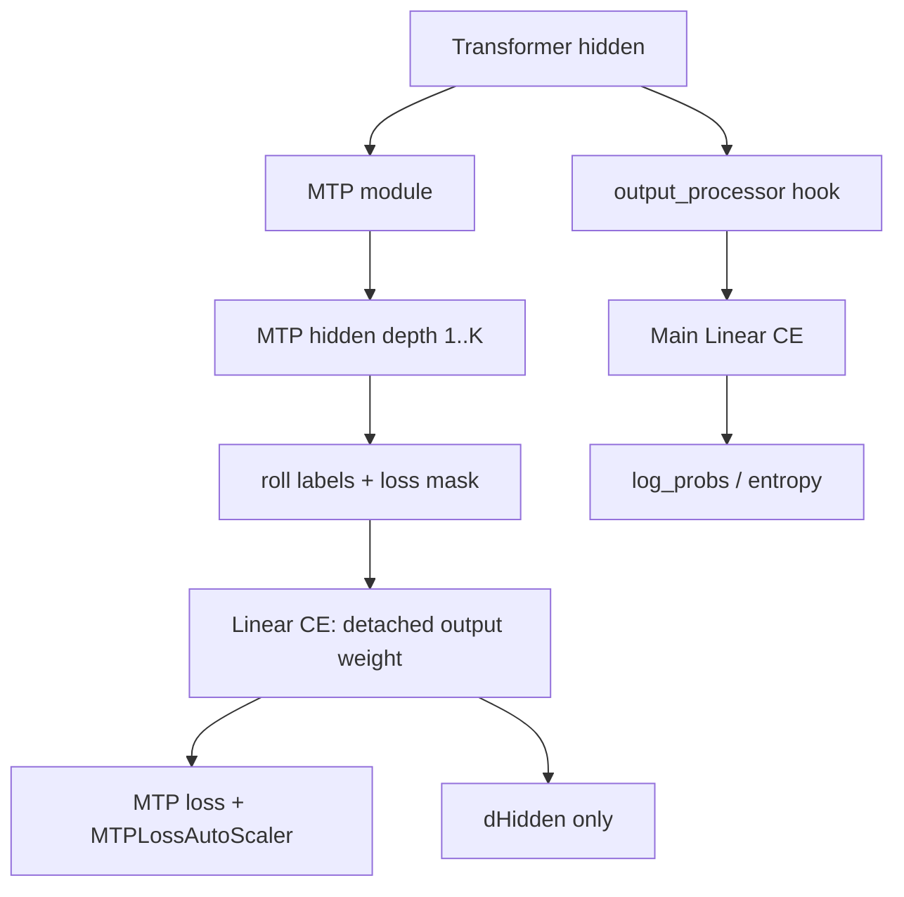

# verl Megatron MTP 支持 Fused Linear Cross Entropy 落地方案

Last updated: 09/04/2026

> 过程文档：随 `hz/feat/mtp-fused-linear-ce` 分支暂存于 `todo/`，最终 ready 后可移除。
> 最新验证命令、结果和未完成项见 [验证与实施记录](verl_mtp_fused_linear_ce_validation.md)。

## 2026-09-04 范围调整：先落地主头兼容

本次实施以本节为准；下方 2026-08-19 草案保留作为历史设计，辅助 CE / dHidden-only 部分暂不实施。

- 分支：`hz/feat/mtp-fused-linear-ce`，基于 `a95cebd0`。
- 首版只打通主头 fused Linear CE 与 MTP postprocess 的组合，继续使用已有 `use_fused_kernels` 开关，不增加 `mtp_linear_cross_entropy` 配置。
- 原生 MCore `process_mtp_loss` 与 legacy 辅助 logits + CE 路径保持原样，包括权重梯度、mask、日志和 loss scaling；仅在辅助 loss 注入 hidden 后调用主头 output processor。
- 主头使用普通 autograd 梯度，而 MCore 辅助头可能直接累加 `main_grad`。输出权重设置 MCore 标准的 `zero_out_wgrad=True`，避免 DDP 因 `grad_added_to_main_grad=True` 跳过主头梯度；此项有跨 microbatch 的回归测试。
- 主头 labels 放入 output-processor context，model labels 仅控制 MTP 训练，避免仅加载 MTP 就触发辅助 loss。
- 使用共享 labels/mask 对齐函数，传递 packed position、Dynamic CP group 和 loss normalization 元数据。
- 首版支持 text GPTModel、原生 output-processor hook、THD/remove-padding；TP>1 要求 SP。旧版 forward、vision wrapper、value model、MuP、FP8 output、deferred output wgrad 和 output bias 回退。
- 尚未实测 GPU 峰值显存或吞吐；需用目标模型/硬件做 fused off/on 对照后，判断是否继续优化辅助 CE。

**对原方案的关键修正：不能默认把所有 MTP auxiliary weight detach。** 本地 legacy 路径会 detach，但 MCore 0.18 原生路径不保证这一行为，更新的上游还可能由 `mtp_detach_heads` 控制。未来如增加辅助 Linear CE，必须尊重原有梯度需求，只有权重原本不求梯度时才能走 dHidden-only。

单头 `T × V/TP × dtype_bytes` 仅是张量大小估算，不是实际峰值节省量；不能直接用 `(1+K)` 乘积承诺显存收益。当前 split-N backward 仍有局部 dLogits buffer，主头融合也不保证吞吐提升。

测试中另发现原有 `preprocess_thd_engine` 的短序列边界：两条 8-token 输入、TP=2、CP=2、FP8 hybrid、zigzag 下，末尾总长度补齐会导致非 fused 路径先报张量 shape 错误。本次未修改这个独立的打包问题；对齐回归使用基线可运行的序列长度。完整 Engine 本来也拒绝 Dynamic CP 与 FP8 组合，底层 packing 测试不能视为放开该运行配置。

本地验证记录（2026-09-04）：`tests/models/test_mtp_fused_main_ce_on_cpu.py` 共 44 项通过；Ruff 0.12.2 lint/format、语法编译及 `git diff --check` 通过。CPU 测试使用临时环境中的 PyTorch 2.14.0，显式 stub MCore collectives、AutoScaler 与 Triton，运行真实的 verl packing/forward/postprocess 及 PyTorch autograd。尚未运行仓库目标 PyTorch 2.11.0 + 完整 MCore 栈、真实分布式通信或 GPU 显存/吞吐测试；不能将本地结果作为这些环境的验收结论。

### 当前实施的启用与回退

```yaml
actor_rollout_ref:
  model:
    use_remove_padding: true
    use_fused_kernels: true
    mtp:
      enable: true
      enable_train: true  # false 时只加载 MTP，不计算辅助 loss
```

回退只需设置 `actor_rollout_ref.model.use_fused_kernels=false`，保留其他 MTP 配置。下方历史草案中的 `mtp_linear_cross_entropy` 开关、辅助头融合和强制 detach 均不是本分支已实现功能，不应据此配置或验收。

### 是否值得继续落地

当前阶段值得作为可回退的兼容性改造进行验证：MTP 原先使主头也失去已有的省 logits 显存路径，本次先恢复这部分能力，不改辅助 CE 语义。它是待目标环境验收的实现，不是已证明收益的生产优化。

是否进一步实现辅助 Linear CE，应在同一模型、batch、序列长度和并行配置下完成 fused off/on 对照后决定。若主头融合后辅助 logits 仍是主要显存瓶颈，且预计显存收益值得额外的梯度与版本兼容成本，再评审下一阶段；否则先停在当前范围。最终 ready 标准和具体待验证矩阵见验证记录。

## 历史草案（辅助 CE 部分待重新评审）

> 状态：Draft
>
> 日期：2026-08-19
>
> 目标后端：verl Megatron Engine
>
> 目标场景：MTP 训练下避免为主预测头和 MTP 辅助头显式物化完整 logits，降低峰值显存

## 1. 结论

建议实现，而且应分两步落地：

1. 先让现有 fused Linear Cross Entropy 与 MTP forward/postprocess 共存，消除主预测头的完整 logits。
2. 再将 MTP 各预测深度的辅助 CE 替换成 dHidden-only 的 fused Linear CE，消除 MTP 辅助头的完整 logits，并跳过无用的输出层权重梯度。

第一版不需要重新写整套 Triton kernel。可以复用 verl 当前的 fused Linear CE forward 和 split-N backward，只需让 backward 根据 `ctx.needs_input_grad` 跳过 `dWeight` 的分配与计算。MTP 辅助路径中继续 detach output weight，保持当前语义，此时只计算 `dHidden`。

建议用独立开关灰度启用：

```yaml
actor_rollout_ref:
  model:
    use_remove_padding: true
    use_fused_kernels: true
    fused_kernel_options:
      mtp_linear_cross_entropy: true
```

在稳定前，`mtp_linear_cross_entropy` 默认设为 `false`。value model 仍不启用 Linear CE。

## 2. 当前实现与问题定位

### 2.1 verl 已有 Linear CE

verl Megatron 后端已有自研 Triton fused Linear Cross Entropy：

- Python/autograd 入口：`verl/utils/kernel/linear_cross_entropy.py`
- Triton forward mainloop：`verl/utils/kernel/kernels.py` 中的 `efficient_entropy_kernel_general_mainloop`
- forward host：`efficient_entropy_forward`
- 默认 backward：`efficient_entropy_backward_kernel_general_d_logits_split_N`
- backward host：`efficient_entropy_backward`

它把 hidden 与 vocab-parallel output weight 直接交给 kernel，以分块方式计算 log-probability、entropy 和梯度，避免常驻完整 `[tokens, vocab]` logits。

但默认 backward 仍会：

- 分配 `dHidden`；
- 分配并计算 `dWeight`；
- 使用一个形如 `[tokens, 9504]` 的局部 `dLogits` chunk，而不是零 logits 临时空间。

因此当前 kernel 已经能显著降低 logits 显存，但 MTP 辅助分支还需要增加 dHidden-only 模式，才能避免没有意义的 `dWeight` 开销。

### 2.2 为什么当前 MTP 会禁用 fused kernel

Megatron engine 的 `_maybe_enable_fused_kernels()` 当前在以下任一条件成立时禁用 fused kernel：

```python
is_value_model or model_config.mtp.enable
```

两者原因不同：

- value model 的输出通常是 `hidden -> 1` 的标量 value，不是 vocabulary classification，不适用 Linear CE；保留禁用是正确的。
- MTP 不是算子本身不兼容，而是 forward/postprocess 集成尚未完成。

当前 fused forward 通过 `output_processor` 在 output layer 前截获 hidden，并调用一次 Linear CE；而 `mtp_patch.py` 自己替换了 GPTModel postprocess，用来：

- 调用 MTP module；
- 对每个 MTP depth 平移 labels/loss mask；
- 计算和缩放辅助 MTP loss；
- 最后调用主 output layer 生成 logits。

目前 patched postprocess 虽然签名中已有 `output_processor` 和 `output_processor_context`，但没有真正调用它们。因此直接打开 fused kernel 会导致主 CE hook 被绕过，或者 MTP loss 路径丢失。

### 2.3 MTP 辅助 CE 当前仍物化 logits

MTP fallback 路径对每个预测深度执行：

```text
mtp hidden
  -> output_layer / linear_with_grad_accumulation...
  -> mtp_logits [tokens, vocab/tp]
  -> compute_language_model_loss
```

output layer 参数在 MTP 辅助 loss 路径中被 detach；也就是说，该路径只需要把 CE 梯度传回 MTP hidden，不需要输出层 `dWeight`。这正适合 dHidden-only Linear CE。

## 3. 设计目标与非目标

### 3.1 目标

- MTP 开启但不训练时，主预测头仍可使用 fused Linear CE。
- MTP 训练时，主预测头和每个 MTP 辅助头都不显式物化完整 logits。
- 保持现有 MTP label shift、loss mask、loss scaling、日志和 gradient routing 语义。
- 保持 tensor parallel、sequence parallel、pipeline parallel 和 context parallel 的正确性。
- 不改变 actor forward 的返回契约：`log_probs`、可选 `entropy` 和已有 loss 字段保持兼容。
- 不支持时明确 fallback，不静默改变训练语义。

### 3.2 第一版非目标

- value model Linear CE。
- reward/value head 融合。
- per-token/per-sample temperature。
- distillation、`sum_pi_squared` 或任何必须读取完整 logits 的功能。
- 第一版即实现完全零 `dLogits` 临时空间的新 kernel。
- 第一版兼容所有旧版 Megatron-Core monkey-patch forward。

## 4. 推荐架构



核心原则是把两件事解耦：

1. 主预测头的 labels 由 `output_processor_context` 持有，用于主 fused Linear CE。
2. 传给 GPTModel 的 `labels/loss_mask` 只负责控制是否执行 MTP 辅助训练。

这样可以覆盖两个容易混淆的状态：

- `mtp.enable=true, mtp.enable_train=false`：model 收到 `labels=None`，不计算 MTP 辅助 loss；output processor 仍持有主 labels，主预测头可以 fused。
- `mtp.enable=true, mtp.enable_train=true`：model 收到 labels/loss mask，执行 MTP 辅助 fused CE；output processor 同时处理主预测头。

## 5. 分文件改造方案

### 5.1 `verl/workers/engine/megatron/transformer_impl.py`

#### 修改 fused kernel gate

将当前无条件排除 MTP：

```python
if self.is_value_model or self.model_config.mtp.enable:
    use_fused_kernels = False
```

改为能力判断：

```python
if self.is_value_model:
    use_fused_kernels = False
elif self.model_config.mtp.enable:
    use_fused_kernels = mtp_fused_linear_ce_is_supported(...)
```

建议 `mtp_fused_linear_ce_is_supported()` 至少检查：

- `use_remove_padding=true`；
- CUDA/Triton 可用；
- Megatron-Core 支持原生 output-processor hook；
- 未启用需要完整 logits 的功能；
- MTP 训练时已显式打开 `fused_kernel_options.mtp_linear_cross_entropy`。

不满足条件时记录一次结构化 warning，并回退到现有非 fused 路径。

#### 扩展 fused engine forward 参数

调用 `get_mcore_forward_fused_model_engine_fn()` 时新增：

```python
loss_mask=loss_mask,
mtp_enable_train=(
    self.model_config.mtp.enable
    and self.model_config.mtp.enable_train
),
```

fused 路径需要复用普通 forward 中 MTP labels/loss mask 的预处理逻辑，尤其是 THD packing、CP layout 和 MTP nested mask。建议抽出共享 helper，避免两条路径长期漂移。

### 5.2 `verl/models/mcore/model_forward_fused.py`

#### 扩展 output processor context

当前 context 只持有 temperature。建议改成：

```python
@dataclass
class FusedOutputProcessorContext:
    labels: torch.Tensor
    temperature: float
    calculate_entropy: bool
    fuse_mtp_aux_ce: bool = False
```

`fused_output_processor()` 应从 context 读取 labels，而不是依赖传给 GPTModel 的 labels。这是支持“加载 MTP 但不训练 MTP”的关键。

#### 分离主 labels 与 MTP labels

伪代码：

```python
main_labels = labels

if mtp_enable_train:
    model_labels = labels
    model_loss_mask = loss_mask
else:
    model_labels = None
    model_loss_mask = None

context = FusedOutputProcessorContext(
    labels=main_labels,
    temperature=temperature,
    calculate_entropy=calculate_entropy,
    fuse_mtp_aux_ce=mtp_enable_train and mtp_linear_ce_enabled,
)

model(
    ...,
    labels=model_labels,
    loss_mask=model_loss_mask,
    output_processor=fused_output_processor,
    output_processor_context=context,
)
```

#### 限制 legacy 路径

第一版仅支持 Megatron-Core 原生 output-processor hook。旧版 `_fused_GPTModel_forward` 会整体替换 GPTModel forward，与 `mtp_patch.py` 的 postprocess patch 组合风险较高。

建议：

- 原生 hook 可用：启用 MTP fused Linear CE。
- 只能走 legacy monkey patch：明确 warning 并回退非 fused。

不要在第一版同时维护两套相互嵌套的 GPTModel patch。

### 5.3 `verl/models/mcore/mtp_patch.py`

#### 让 patched postprocess 尊重 output processor

处理完 MTP auxiliary loss 后，主预测头部分改为：

```python
if output_processor is not None:
    return output_processor(
        hidden_states,
        self.output_layer,
        output_weight,
        output_processor_context,
    )

logits, _ = self.output_layer(hidden_states, weight=output_weight)
return logits.transpose(0, 1).contiguous()
```

具体参数顺序应以当前 Megatron-Core hook contract 为准，重点是不能再无条件调用 output layer。

#### 增加 Verl-owned MTP fused loss helper

新增类似函数：

```python
def compute_mtp_fused_linear_ce(
    mtp_hidden_states,
    labels,
    loss_mask,
    output_weight,
    num_mtp_tokens,
    mtp_loss_scaling_factor,
    calculate_per_token_loss,
    ...,
):
    ...
```

对每个 MTP depth：

1. 采用现有实现完全相同的 label/loss-mask roll 规则。
2. 将 ignore/越界 label 替换为安全索引 `0`，同时将其并入 valid mask。当前 Linear CE kernel 没有 `ignore_index` 参数，不能直接把 `-100` 传入 kernel。
3. 按 Megatron tensor/sequence parallel 语义整理 hidden。
4. 获取 tied embedding weight 或 `output_layer.weight`。
5. 对 auxiliary weight 执行 detach，保持当前 MTP 辅助 loss 不更新输出层的行为。
6. 调用 Linear CE，auxiliary temperature 固定为 `1.0`；不要复用 PPO log-probability 的 sampling temperature。
7. 用 valid mask 计算 `-log_probs`，保持现有 `calculate_per_token_loss` 的归一化方式。
8. 保持现有 `MTPLossAutoScaler`、per-depth logging 和总 loss scaling。

对于带原生 `process_mtp_loss()` 的新 Megatron-Core：

- fused 开关关闭时继续走原生实现；
- fused 开关打开时走 Verl-owned helper，避免原生实现内部再次物化 MTP logits；
- 通过 feature detection 处理不同 MCore 版本，不依赖单一版本号硬编码。

### 5.4 `verl/utils/kernel/linear_cross_entropy.py`

让 autograd wrapper 尊重 `ctx.needs_input_grad`：

```python
need_dhidden = ctx.needs_input_grad[0]
need_dweight = ctx.needs_input_grad[1]

dhidden, dweight = efficient_entropy_backward(
    ...,
    need_dhidden=need_dhidden,
    need_dweight=need_dweight,
)
```

并只保存 backward 真正需要的 tensor。MTP auxiliary weight detach 后，`need_dweight=False`。

需要覆盖四种组合：

| dHidden | dWeight | 行为 |
|---:|---:|---|
| true | true | 保持现有主预测头行为 |
| true | false | MTP auxiliary 推荐路径，只算 dHidden |
| false | true | 如无实际调用方，可先支持正确性而不专项优化 |
| false | false | 直接返回 `None, None` |

### 5.5 `verl/utils/kernel/kernels.py`

#### 第一版：复用现有 kernel，跳过 dWeight

为 `efficient_entropy_backward()` 增加：

```python
need_dhidden: bool = True
need_dweight: bool = True
```

在默认 split-N backward 中：

- `need_dhidden=false` 时不分配/写入 dHidden；
- `need_dweight=false` 时不分配 dWeight，不执行 `_d_logits.T @ hidden`；
- `need_dhidden=true` 时仍用 `_d_logits @ weight` 计算 dHidden；
- 只在两个梯度都需要时保持当前路径完全不变。

这一步不要求新增 Triton kernel。现有 split-N kernel 仍生成局部 dLogits chunk，但不会生成完整 `[tokens, vocab]` logits，改动范围和回归风险最小。

#### 第二版：CE-only forward

MTP auxiliary 只需要 CE loss，不需要 entropy。后续可增加：

```python
calculate_entropy: bool
```

当其为 false 时跳过 entropy accumulator、`entropy_b` 和相关 reduction，进一步降低临时显存和计算量。

#### 第三版：真正 dHidden-only fused backward

如果 profile 表明 `[tokens, 9504]` 局部 dLogits 仍是主要峰值，可基于现有完整 fused mainloop 新增 dHidden-only kernel，在 vocab block 内重算 logits/softmax derivative，并立即累加到 dHidden，不落地局部 dLogits。

仓库中虽已有未走默认 host path 的 dHidden kernel，但在没有覆盖以下情况的 benchmark 与正确性验证前，不建议直接接入生产：

- 非 2 的幂 vocab shard；
- BF16/FP16 accumulation；
- 大 hidden size；
- 多个 TP size；
- labels 位于不同 vocab shard；
- entropy 开关；
- 数值稳定性和吞吐。

## 6. Tensor Parallel 与 Sequence Parallel

Linear CE 的 vocab reduction 已由 kernel/通信逻辑处理，但 dHidden 还必须遵循 Megatron tensor-parallel 语义。

### sequence parallel 开启

推荐路径：

```text
local sequence hidden
  -> gather_from_sequence_parallel_region
  -> Linear CE on gathered tokens
  -> autograd backward reduce-scatter dHidden
```

这与主 fused output processor 的处理方式保持一致，MTP helper 应复用同一段逻辑。

### sequence parallel 关闭

vocab-parallel 每个 rank 计算的是局部 vocab 对 dHidden 的贡献，backward 必须进行 TP all-reduce。可以通过 Megatron 的 `copy_to_tensor_model_parallel_region` 保持 forward identity、backward all-reduce。

如果第一版无法在所有 MCore 版本上确认该路径，建议 MVP 先要求：

```text
MTP fused Linear CE + TP > 1 => sequence_parallel=true
```

并对不满足条件的配置显式 fallback，不能返回缺少 TP reduction 的错误梯度。

## 7. THD、CP 与 labels/loss mask

第一版建议限定 `use_remove_padding=true`，即 THD/packed 路径，原因是 verl 当前 fused forward 已以该路径为主要支持目标。

需要保证：

- 主 labels 在 flatten 后与 hidden token 顺序完全一致；
- MTP depth `k` 使用与现有实现一致的 `roll(-(k + 1))` 或等价规则；
- sequence boundary、padding 和 CP 切片边界不会让 label 跨样本串联；
- ignore/pad token 在进入 kernel 前被替换为安全 label，并通过 mask 从 loss 中移除；
- CP 下的 nested MTP mask 预处理与普通 forward 完全一致。

建议把普通与 fused forward 的 MTP label/mask 构造抽成单一 helper，并用相同测试向量验证，避免复制逻辑。

## 8. 功能兼容矩阵

| 场景 | 主 Linear CE | MTP auxiliary Linear CE | 处理方式 |
|---|---:|---:|---|
| value model | 否 | 不适用 | 保持禁用 |
| MTP 关闭 | 是 | 不适用 | 保持现有 fused 路径 |
| MTP 加载、`enable_train=false` | 是 | 不执行 | context 持有主 labels |
| MTP 训练、开关关闭 | 否 | 否 | 保持现有路径 |
| MTP 训练、开关开启、原生 hook 可用 | 是 | 是 | 目标路径 |
| MTP 训练、仅 legacy GPTModel patch 可用 | 否 | 否 | warning + fallback |
| per-sample/per-token temperature | 否 | 否 | fallback |
| distillation / 需要完整 logits 的 loss | 否 | 否 | fallback |
| `sum_pi_squared` 等 logits 统计 | 否 | 否 | fallback |

## 9. 建议实施顺序

### Phase 0：上游重复工作检查

在提交 PR 前，搜索 verl open PR/issue 和相关分支，确认没有相同实现正在进行，并在 PR 描述中记录检查结果。

### Phase 1：kernel 可选梯度

- `linear_cross_entropy.py` 读取 `ctx.needs_input_grad`。
- `kernels.py` 支持跳过 dWeight。
- 增加 TP=1 CUDA correctness 与显存测试。

这一阶段可以独立合入，风险低，也可被其他 detached-classifier 场景复用。

### Phase 2：主 fused CE 与 MTP 共存

- postprocess 调用 output processor。
- context 独立持有主 labels。
- engine fused path 传递 `mtp_enable_train` 和 loss mask。
- MTP 加载但不训练场景先打通。

完成后即使 MTP auxiliary 尚未 fused，也能先消除主预测头完整 logits。

### Phase 3：MTP auxiliary fused CE

- 实现 Verl-owned MTP fused helper。
- 保持 detach output weight、loss scaling 与日志语义。
- 接入 dHidden-only backward。
- 完成 TP/SP/PP/CP 集成测试。

### Phase 4：性能优化

- CE-only forward 跳过 entropy。
- profile 局部 dLogits chunk。
- 仅在收益明确时开发真正 zero-dLogits 的 dHidden-only kernel。

## 10. 测试计划

### 10.1 单元测试

- gate matrix：value、MTP enable、MTP train、原生 hook、legacy hook。
- MTP 未训练时，model labels 为 `None`，主 output processor 仍能拿到 labels。
- patched postprocess 在处理完 MTP 后确实调用 output processor。
- `num_mtp_tokens=1/2/4` 时 fused helper 调用次数和 label shift 正确。
- `-100`、pad label、越界 label 不进入 Triton gather。
- detached weight 下 `dWeight is None`，`dHidden` 存在。
- `calculate_per_token_loss` 两种模式与旧实现一致。

### 10.2 CUDA kernel 对齐测试

以 PyTorch `linear + cross_entropy` 为 reference，覆盖：

- FP16、BF16；
- 多个 token、hidden、vocab shard size；
- vocab size 不能整除 block size；
- TP=1 与 TP=2；
- labels 命中本 rank 和其他 rank vocab shard；
- dHidden-only 与 dHidden+dWeight；
- loss、dHidden、dWeight 的数值容差；
- 峰值显存与临时 buffer 大小。

### 10.3 Megatron 分布式集成测试

至少覆盖：

- TP1/SP off；
- TP2/SP on；
- PP2；
- CP2 + THD；
- `mtp.enable=true, enable_train=false`；
- `mtp.enable_train=true`；
- tied/untied output weight；
- `detach_encoder=true/false`；
- `calculate_entropy=true/false`；
- 新旧可支持的 MCore 版本。

### 10.4 端到端训练测试

用小型 MTP 模型运行固定 steps，对比 fused 开关前后：

- 主 log-probability；
- 主 loss；
- 每个 MTP depth loss；
- transformer/MTP/output-layer gradient norm；
- optimizer step 后参数差异；
- tokens/s；
- allocated/reserved peak memory。

## 11. 验收标准

功能验收：

- MTP 加载但不训练时，主 Linear CE 可正常工作。
- MTP 训练时，主预测头和所有辅助预测头均不生成完整 `[tokens, vocab/tp]` logits。
- fused 与 reference 的 loss/gradient 在 FP16/BF16 合理容差内一致。
- auxiliary output weight 仍不接收梯度，MTP hidden 正常接收梯度。
- TP/SP/PP/CP 指定组合通过测试。
- 不支持配置会明确 fallback，并输出原因。

显存验收：

- profiler 中不存在主预测头或 MTP 辅助头的完整 logits 常驻分配。
- 第一版允许存在现有 split-N backward 的 `[tokens, chunk_n]` 临时 dLogits；必须在文档和 benchmark 中明确其大小。
- 相比现有 MTP 路径，峰值 allocated memory 有稳定下降；建议分别报告主 CE 打通和辅助 CE 打通后的增益。

性能验收：

- 不能只看显存；同时报告 step time、tokens/s 和通信时间。
- 默认开关前，至少在目标模型/序列长度上证明无明显吞吐回退。

## 12. 主要风险与规避措施

| 风险 | 后果 | 规避措施 |
|---|---|---|
| MTP patch 忽略 output processor | 主 fused CE 被绕过 | 单测 postprocess hook 调用和返回值 |
| `-100` label 直接进入 kernel | 越界读取或错误 loss | kernel 前 sanitize label + valid mask |
| TP dHidden 未归约 | 梯度错误但不一定报错 | SP/TP 专项数值测试；不支持时 fallback |
| auxiliary weight 未 detach | 改变 MTP 训练语义 | 检查 `dWeight is None` 与 output-layer grad norm |
| 主 CE temperature 被用于 MTP loss | 辅助目标发生变化 | MTP CE 固定 temperature=1.0 |
| MCore hook/postprocess 签名变化 | 版本兼容失败 | feature detection + 集中 adapter + version CI |
| 普通与 fused label/mask 逻辑漂移 | CP/packed loss 错误 | 提取共享 helper，不复制实现 |
| 默认 backward chunk 仍偏大 | 显存收益不足 | profile 后推进 zero-dLogits dHidden kernel |
| entropy 无用但仍计算 | 额外算力与 buffer | Phase 4 增加 CE-only 模式 |

## 13. 回滚方案

所有新行为由以下开关控制：

```yaml
fused_kernel_options:
  mtp_linear_cross_entropy: false
```

回滚只需关闭该开关，恢复当前 MTP logits + CE 路径。能力检测失败也自动走同一 fallback。不要通过修改 checkpoint 格式实现本功能，确保开关前后的 checkpoint 可互相加载。

## 14. 预期收益

设：

- 有效 token 数为 `T`；
- TP 后局部词表为 `V_tp`；
- MTP 预测深度为 `K`；
- logits dtype 字节数为 `b`。

现有路径的 logits 量级约为：

```text
(1 + K) * T * V_tp * b
```

实际峰值取决于各 depth 的生命周期和 autograd 保存策略，但长序列、大词表或较大 `K` 时，MTP auxiliary logits 往往成为明显显存项。

第一版 fused 后，完整 vocab 维被替换为分块临时空间，默认 backward 主要临时量级约为：

```text
T * chunk_n * b
```

当前 `chunk_n` 约为 9504，且可以通过后续 dHidden-only kernel 继续消除。因而该方案既能先以较小改动获得主要显存收益，也保留进一步优化空间。

## 15. 最终建议

建议按以下边界提交首个可落地 PR：

1. 仅支持 CUDA、THD/remove-padding、Megatron-Core 原生 output-processor hook。
2. value model 和 legacy monkey-patch 路径保持禁用。
3. 先实现 `ctx.needs_input_grad` 和 dHidden-only host 分支，不新写 kernel。
4. patched MTP postprocess 接入主 output processor。
5. MTP auxiliary 使用 Verl-owned Linear CE helper，output weight 保持 detach。
6. TP>1 首版优先要求 sequence parallel；其他组合完成验证后再放开。
7. 默认关闭，通过显存、吞吐、数值三类 benchmark 后再考虑默认启用。

这个范围能解决真正的 MTP logits 峰值问题，同时把 MCore 版本兼容、分布式梯度语义和 kernel 深度优化拆成可测试、可回滚的阶段。
